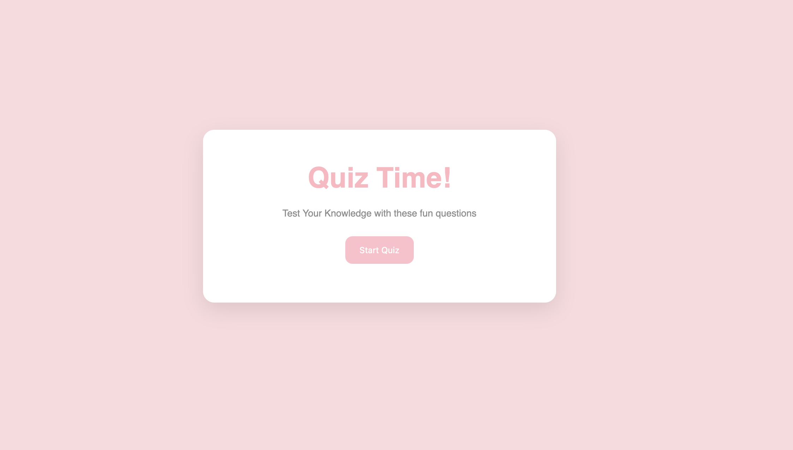

Quiz Game 🎯

An interactive Quiz Game built with HTML, CSS, and JavaScript.
I made this project to get better at JavaScript and understand how it connects with HTML and CSS. Building it helped me practice things like updating the screen when players click buttons, keeping score, and using events to make the quiz feel alive. It really helped me get more comfortable writing and organizing my own code.

⸻

📘 Features

	•	Start screen, quiz screen, and result screen - in pink! 
	•	Dynamic question and answer generation using JavaScript
	•	Real-time score and progress bar
	•	Automatic result feedback based on performance
	•	Responsive layout for all screen sizes

⸻

🧩 Languages Used

	•	HTML5 – Structure of the quiz screens
	•	CSS3 – Styling and layout (pastel pink theme)
	•	JavaScript (ES6) – Game logic, dynamic content, and screen control

⸻

📂 Project Structure

Quiz-Game/
│
├── index.html # Main HTML file

├── styles.css # Styling for layout and theme

└── script.js # Quiz logic and event handling
